## UX Evidence Gallery

This gallery collects screenshot evidences that demonstrate the application's primary functional flow (the Happy Path). The purpose is to provide a clear, visual walkthrough for non-technical stakeholders — recruiters, clients and evaluators — so they can understand the product without running it locally.

Below each evidence is a short description and the corresponding screenshot. Images are referenced with relative paths so the gallery renders correctly on GitHub.

---

## 01 Home

The application's landing page presenting featured products and a global search. It introduces the product catalog and quick actions (add to cart, navigation). This is the starting point for the user's browsing journey.

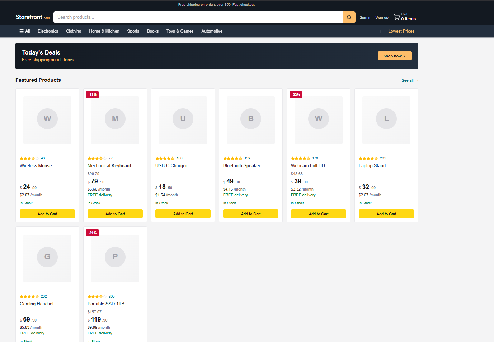

---

## 02 Product Search

Shows the search results page with filters and pagination. Demonstrates product discovery, sorting and how listings are presented before selecting a product.

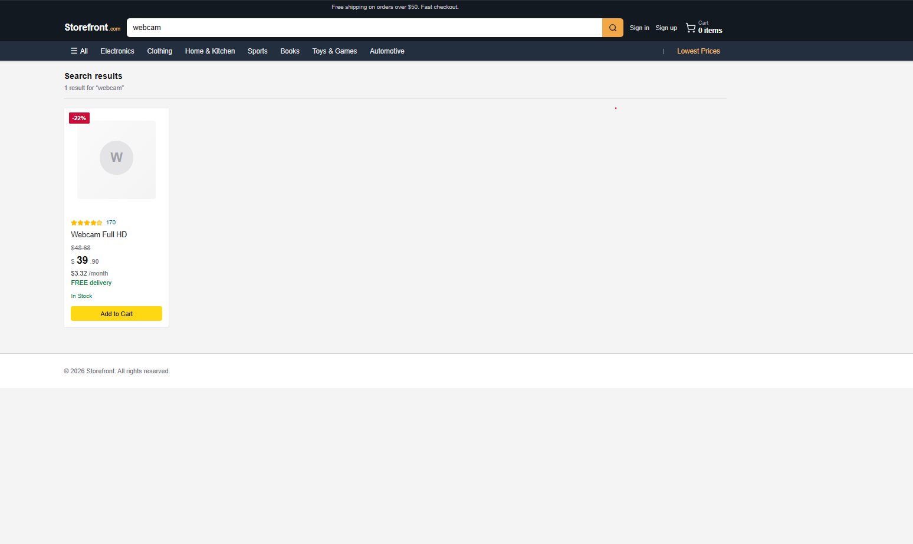

---

## 03 Product Detail

The product detail view with images, price, description and add-to-cart action. This screen highlights product information and purchasing options.

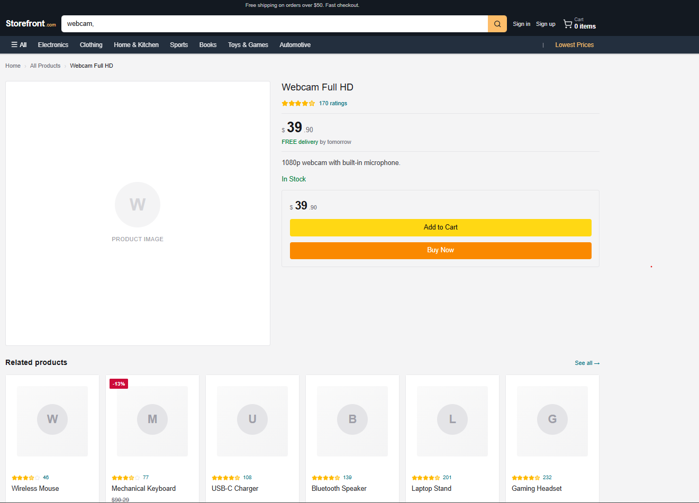

---

## 04 User Signup

Signup form where a new user can register an account. Shows the fields required to create a profile and start the authenticated experience.

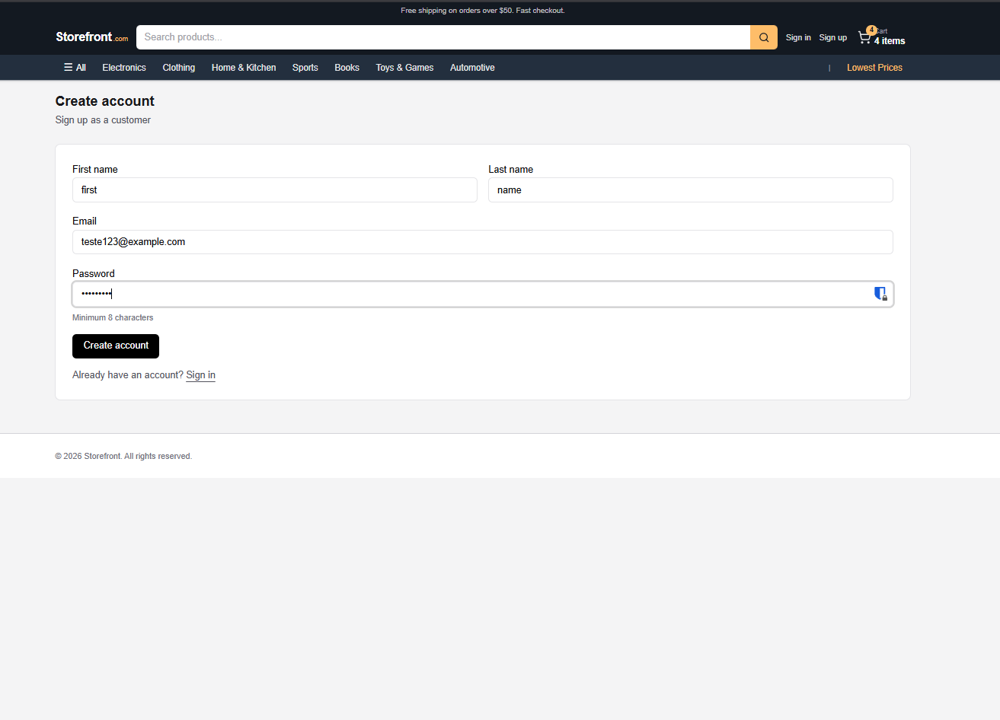

---

## 05 Signup Email Validation

Illustrates email validation step during signup — confirmation prompts or validation messages that ensure the email address is confirmed or correctly formatted.

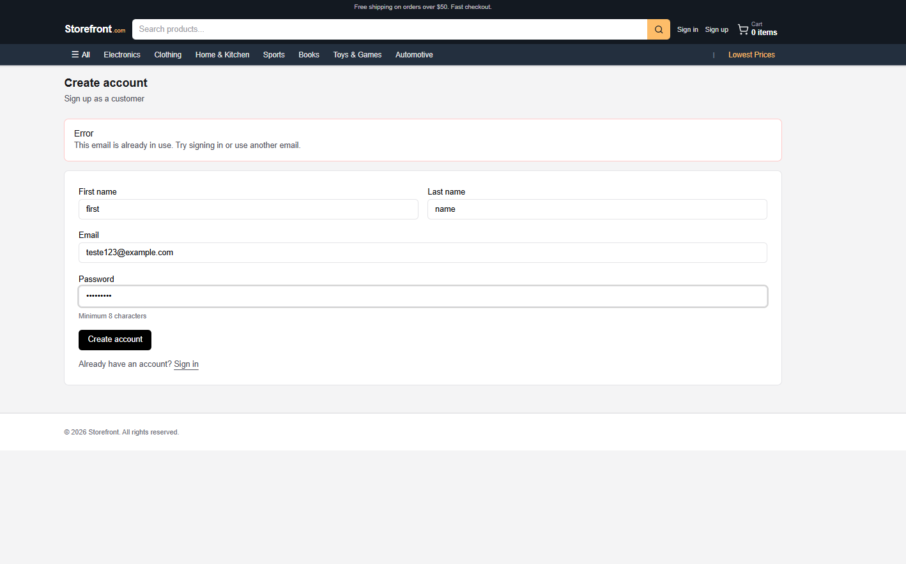

---

## 06 Signup Password Validation

Displays password strength and validation rules enforced during account creation, guiding users to choose secure credentials.

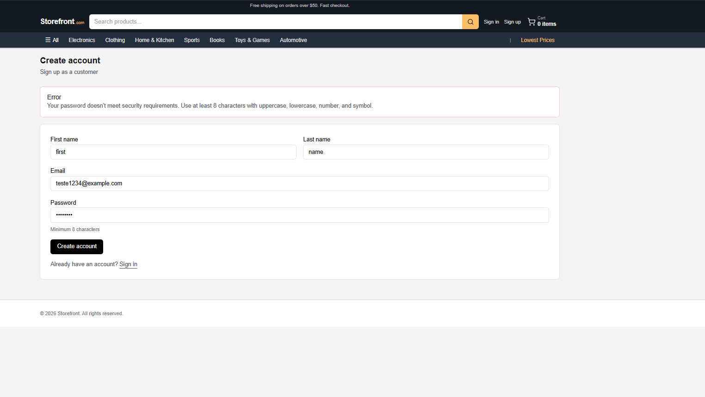

---

## 07 User Login

Login screen for returning users. Demonstrates authentication UI and entry to the account area where orders and profiles are managed.

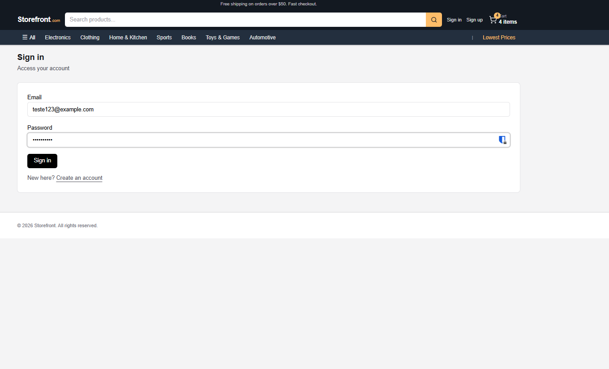

---

## 08 Shopping Cart

Cart overview showing selected items, quantities, prices and the option to proceed to checkout. This screen is the bridge between browsing and purchasing.

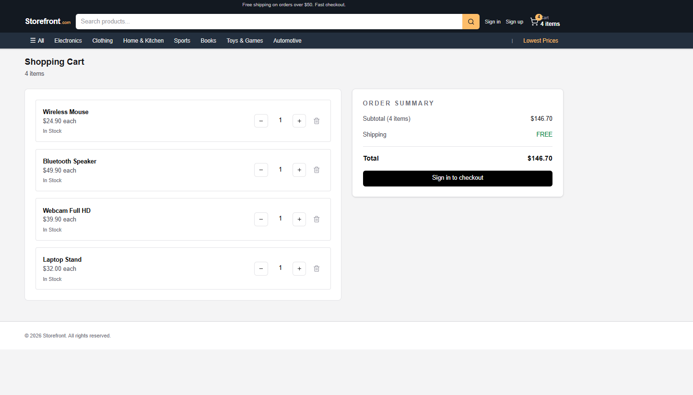

---

## 09 Checkout

Checkout flow where shipping, billing and payment information are entered. Demonstrates the idempotent and transactional checkout orchestration handled by the backend.

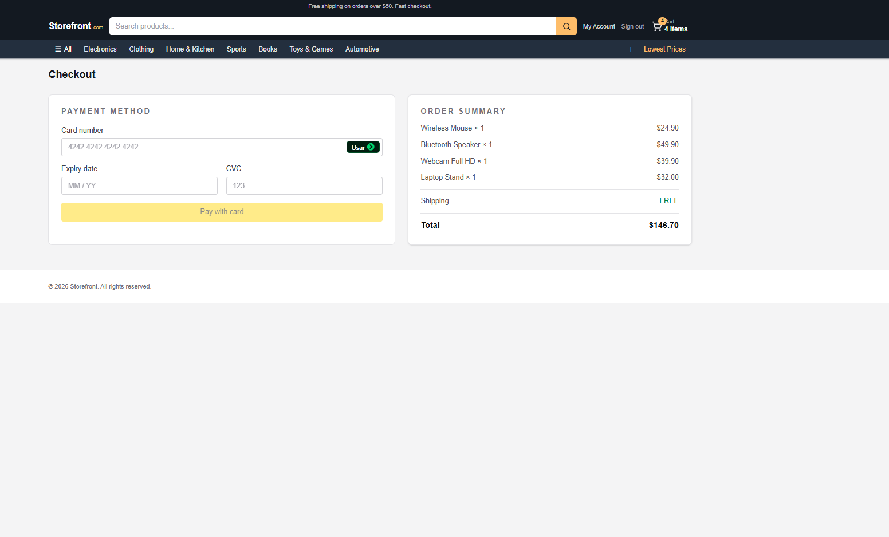

---

## 10 Payment Approved

Confirmation screen displayed after a successful payment, completing the purchase flow and providing order details to the user.

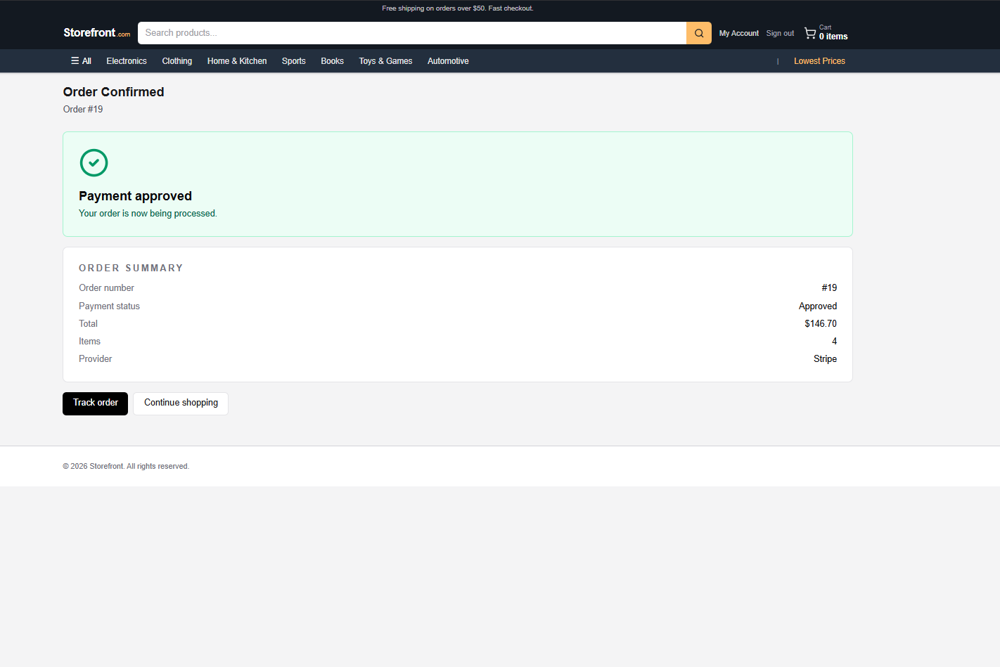

---

## 11 Account Overview

Account dashboard where users can see profile information, recent activity and quick links to orders and settings.

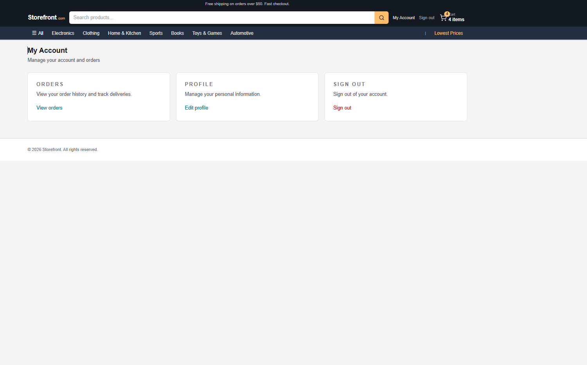

---

## 12 Order History

List of past orders showing status, totals and navigation to order details. Useful for audit, support and user self-service.

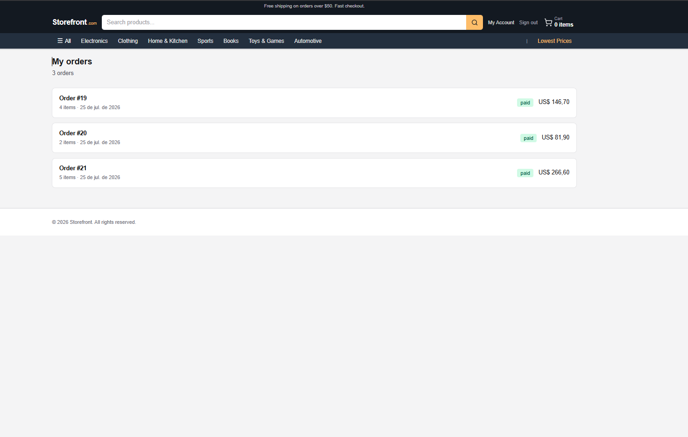

---

## 13 Order Details

Detailed view for a single order, including items, shipping and payment information. This completes the documented Happy Path from discovery to order review.

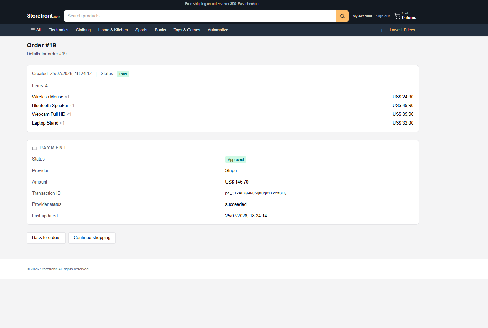

---

Conclusion

This gallery documents the complete functional Happy Path of the application: from homepage discovery, product selection and authentication, through cart and checkout, finishing with order confirmation and account review. It is intended to facilitate quick evaluation and review by stakeholders without running the system.
